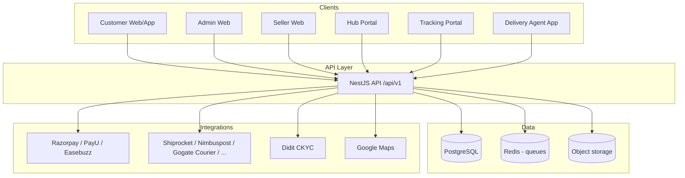

# Gogate Products — Architecture

## System overview

## Order lifecycle (marketplace)

1. Customer places order → **12-digit `orderNumber`**
2. Payment (online PG or COD)
3. Seller **accept** (SLA + ETA) or **reject**
4. Sub-status: *Seller is processing your order* (date/time)
5. Seller books courier (pincode serviceability across providers)
6. Pickup scheduled → *Waiting to be picked up by courier partner*
7. Webhooks/polling update status → customer timeline: Ordered → Shipped → Out for Delivery → Delivered

**Delivered rule:** Customer may see a delivery update while logistics is still OFD; final **Delivered** only after delivery agent submits hub report (`confirm-delivery`).

## Logistics lifecycle (Gogate Courier)

Route plan: **seller pickup → seller hub → hub → hub → customer nearest hub → last mile**

- Admin/courier CMS creates hubs (radius, manager, Didit KYC)
- Shipments: BOOKED → IN_TRANSIT → OUT_FOR_DELIVERY → DELIVERED
- Tracking table: first mile to last mile events
- Vehicles/trucks assigned to legs
- Hub scans update location; pickup/delivery dates auto-generated

## COD flow

1. Order marked COD
2. Agent generates payment QR (gogateproducts.store)
3. On payment: `Shipment.codCollected` + timestamp
4. Order remains OUT_FOR_DELIVERY until hub confirmation

## Security & roles

| Role | Capabilities |
|------|----------------|
| SUPER_ADMIN / ADMIN | Full platform, API keys, verify sellers/hubs/agents |
| SUPPORT | Tickets, customer + order view |
| SELLER | Products, orders, courier booking |
| CUSTOMER | Shop, wallet, returns (eligible items) |
| HUB_MANAGER | Hub ops, agents, scans |
| DELIVERY_AGENT | Deliveries, QR, hub check-in |

## CMS

Admin edits banners, sliders, and site/mobile content stored in `CmsBanner`, `CmsSlider`, `CmsPage`.

## Hyperlocal & store pickup

- `FulfillmentType`: HOME_DELIVERY | STORE_PICKUP | HYPERLOCAL
- Pincode serviceability matrix per courier provider
- Nearest hub + seller inventory for hyperlocal ETA
